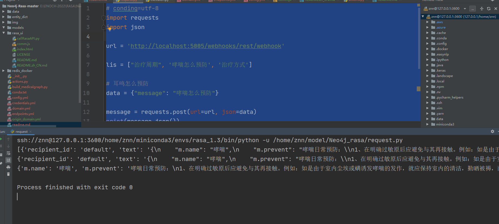
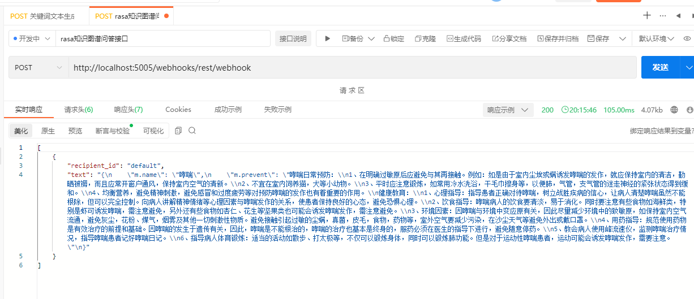
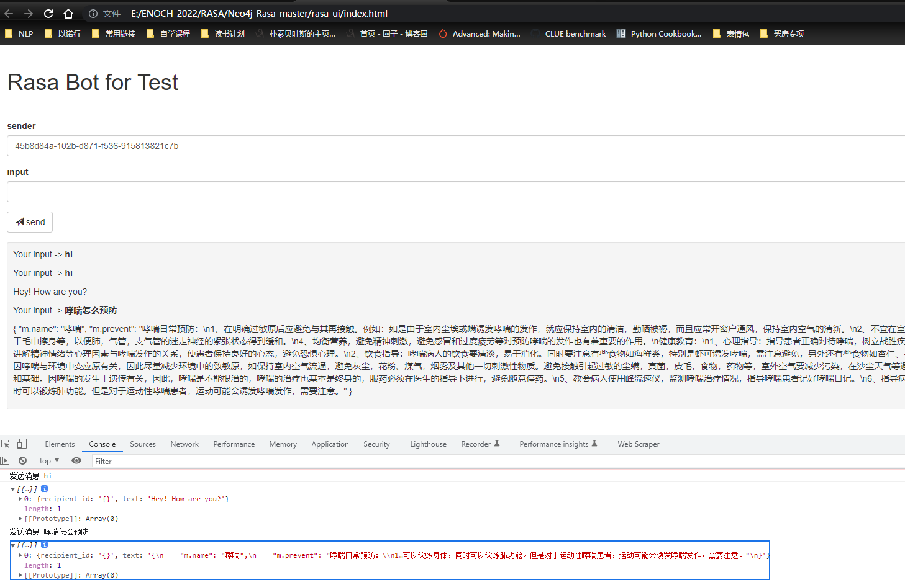
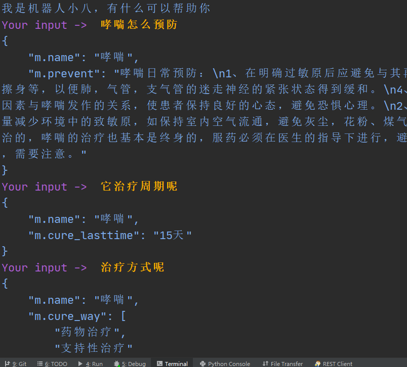
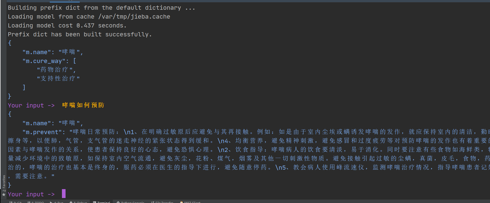

# 基于rasa_neo4j实现多轮和单轮对话

原项目git地址：https://github.com/SonOfGod777/Neo4j-Rasa

我的项目打包地址：https://pan.baidu.com/s/1h3RPpCOw2Ww0Blti1qK5EA?pwd=6666  提取码：6666

## 一、环境准备

​	研究环境 默认ubuntu20.04TL，conda环境，py36

## 二、安装数据库

### 2.1、neo4j准备

```
	docker rm -f rasa_neo4j
	docker run  -d \
	--name rasa_neo4j   \
	-v linux 目录/data:/data  \
	-v linux 目录/log:/logs  \
	-v linux 目录/conf:/var/lib/neo4j/conf  \
	-v linux 目录/import:/var/lib/neo4j/import \
	--env=NEO4J_AUTH=none  \# 没有设置账号和密码，直接点击登录
	--publish=7474:7474  \
	--restart=always  \
	--publish=7687:7687 neo4j:4.1
```

然后执行python build_medicalgraph.py将数据集灌入neo4j 数据库，时间比较长。

### 2.2、redis准备

​	redis安装好后才能进行下步操作，请注意这里的redis并没有设置账号和密码。https://www.jianshu.com/p/c181a7109f67

```
	docker run \
	-p 6379:6379 \
	--name redis \
	-v linux 目录/redis_docker/redis.conf:/etc/redis/redis.conf \
	-v linux 目录/redis_docker/data:/data \
	-d redis redis-server /etc/redis/redis.conf --appendonly yes\
```

## 三、软件环境

​	requirment.txt如下所示，这里的rasa为1.3版本。具体安装包版本可以参照conda.txt。

```
	py2neo==2021.1.5
	rasa_sdk==1.3.3
	redis==3.3.11
	rasa==1.3.1
	requests==2.27.1
```

​	安装环境是坑，尤其是作者没有给出requirment.txt，也不清楚rasa什么版本，rasa train的时候，我从二、三版本逐一实验，均未成功。希望能帮助后来人进行学习和研究。

## 四、训练

### 4.1、训练nlu和core

`python -m rasa train --config config.yml --domain domain.yml --data data/ --out models`

### 4.2、只训练nlu

`python -m rasa train core --domain domain.yml --out models`

### 4.3、只训练core

`python -m rasa train nlu --config config.yml --out models`

## 五、执行交互

### 5.1、启动actions

`python -m rasa run actions --port 5055 --actions actions --debug`

### 5.2、执行交互

`rasa shell --endpoints conf/endpoints.yml`

### 5.3、请求服务

请求服务需要启动下面的命令`rasa run --enable-api --cors * 5005`

#### 5.3.1、直接用request包请求

```
# conding=utf-8
import requests
import json
url = 'http://localhost:5005/webhooks/rest/webhook'
lis = ["治疗周期", '哮喘怎么预防', '治疗方式']
# 耳鸣怎么预防
data = {"message": "哮喘怎么预防"}
message = requests.post(url=url, json=data)
print(message.json())
print(message.json()[0])
print(json.loads(message.json()[0]['text']))
```



#### 5.3.2、采用apipost调用接口



#### 5.3.3、rasa_ui调用接口

```
# rasa_ui使用方法
1. 启动Rasa API（允许跨域）
rasa run --enable-api --cors "*" 5005
2. 直接打开页面`index.html`
```



## 六、单轮和多轮对话

### 6.1、多轮对话



### 6.2、单轮对话



## 7、交流联系

​	QQ：1356922176


